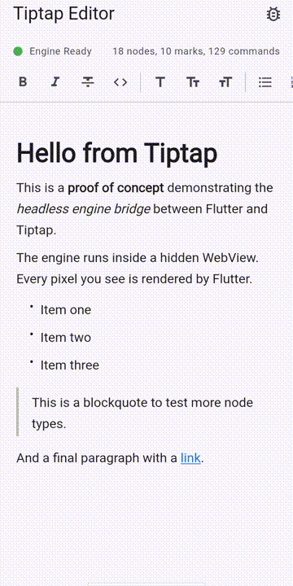

# tiptap_flutter

[](https://www.patreon.com/c/UmarBinAyaz1)

A Flutter rich-text editor powered by the real Tiptap engine running inside a headless WebView. Every pixel on screen is rendered by Flutter — the WebView serves purely as a computation engine.

<p align="center">
  
</p>

## Why this exists

If your web app uses Tiptap, your content is stored in Tiptap's document format — a JSON structure built on ProseMirror's document model. When you build a Flutter app for the same product, you need to read, render, and edit that same content. A from-scratch Dart editor won't understand Tiptap's format, extensions, or schema. You'd have to reimplement the entire ProseMirror document model, every extension's behavior, and keep it all in sync with the web app.

Porting ProseMirror to Dart would take years and kill compatibility with Tiptap's extension ecosystem. Instead of porting the code, we run the original code.

tiptap_flutter loads unmodified Tiptap JavaScript inside a headless WebView. The engine handles all document operations — parsing, schema validation, commands, transactions, undo/redo — exactly as it does on the web. Flutter handles all rendering, input, and UI. Your Flutter app and web app share the same document format, the same extensions, and the same behavior, because they're running the same engine.

## How it compares to existing approaches

Most Flutter rich-text editors (super_editor, flutter_quill, appflowy_editor) implement their own document models from scratch. They work well for apps that start fresh, but they can't read or write Tiptap documents without a translation layer that inevitably loses fidelity.

Some React Native solutions (like 10tap-editor) render ProseMirror in a visible WebView. That gives you the real engine, but also WebView jank — keyboard issues, scroll conflicts, focus fighting, and a non-native feel.

tiptap_flutter takes a different path: real engine, native rendering. The WebView is invisible. Zero pixels from it reach the screen. All rendering, gesture handling, text input, and selection painting are done by Flutter widgets. You get engine compatibility without the WebView UX problems.

## Architecture

The package is split into two parts:

- **[tiptap-engine](https://github.com/blackcoffee2/tiptap-engine)** — a standalone JavaScript bundle that runs unmodified Tiptap inside a headless WebView. It handles all document operations: parsing, schema validation, commands, transactions, undo/redo. This is a separate project and can be used by ports for other frameworks beyond Flutter.

- **tiptap_flutter** — the Flutter port. It renders the document as native Flutter widgets, handles gestures and keyboard input, paints selections and cursors, and communicates with the engine over a JSON message bridge.

Commands flow down as JSON. Events and responses flow back up through the same channel, correlated by command ID. The controller caches state for synchronous access and exposes streams for reactive UI updates.

## Supported content

The engine loads a fixed extension set: Tiptap v3 StarterKit plus the Image node. Both your Flutter app and web app share this set, so documents round-trip without fidelity loss across the following types:

- **Block nodes:** paragraph, heading, blockquote, bullet list, ordered list, list item, code block, horizontal rule, hard break, image
- **Marks:** bold, italic, strike, code, underline, link
- **Behaviors:** undo/redo history, drop cursor, gap cursor, list keymap, trailing node

Changing the extension set is a build-time change on the engine, not a runtime option from the Flutter side. See [Engine assets](#engine-assets) for rebuilding with a different set.

## Quick start

### 1. Add the dependency

```yaml
dependencies:
  tiptap_flutter: ^0.0.4
```

### 2. Create a controller and initialize

```dart
final controller = EditorController();

await controller.initialize(
  content: '<h1>Hello</h1><p>Start editing...</p>',
);
```

### 3. Compose the widgets

```dart
Scaffold(
  body: Column(
    children: [
      TiptapToolbar(controller: controller),
      Expanded(
        child: TiptapEditor(controller: controller),
      ),
    ],
  ),
)
```

### 4. Clean up

```dart
@override
void dispose() {
  controller.dispose();
  super.dispose();
}
```

## Composable API

The package follows the same philosophy as Tiptap React — a headless core with composable UI components.

**EditorController** is the center of everything. It manages the engine lifecycle, sends commands, and exposes state streams. All widgets take a controller.

**TiptapEditor** is the content area — document rendering, gesture handling, selection painting, and keyboard input. This is the only required widget.

**TiptapToolbar** is a standalone formatting toolbar that listens to the controller and rebuilds when state changes. Place it anywhere.

**TiptapPerformanceOverlay** is an opt-in development tool that displays live timing metrics: engine cold-start phases, per-command round-trip statistics, and end-to-end typing latency. Detailed state, document, and bridge inspection is available through the console — the bridge logs every command, response, and event to the terminal during `flutter run`.

For full control, skip the provided widgets and build your own UI using the controller's streams and methods directly:

```dart
controller.editorStateStream.listen((state) {
  // state.doc — the full document tree
  // state.selection — current selection
  // state.activeMarks — active mark types
  // state.commandStates — all command states
});

await controller.execCommand('toggleBold');
await controller.execCommand('setHeading', {'level': 2});
await controller.setContent('<p>New content</p>');

final html = await controller.getHTML();
final json = await controller.getJSON();
```

## Reading and writing content

The editor supports full round-trip content — load a Tiptap document, let the user edit it, and get the modified content back in any format.

```dart
// Initialize with HTML or Tiptap JSON
await controller.initialize(content: '<h1>Hello</h1><p>Edit me</p>');

// Get the current content at any point
final html = await controller.getHTML();
final json = await controller.getJSON();
final text = await controller.getText();

// Replace the entire document
await controller.setContent('<p>Something new</p>');
```

To react to every change as the user types, listen to the editor state stream:

```dart
controller.editorStateStream.listen((state) {
  // Fires on every transaction — typing, formatting, undo, etc.
  // state.doc contains the full annotated document tree
  controller.getJSON().then((json) => saveToBackend(json));
});
```

This makes it straightforward to keep a backend in sync, build autosave, or wire up to any state management solution.

## Image insertion

The toolbar supports image insertion through a developer-provided callback. The library has no opinion on how images are sourced — you bring your own picker and upload logic.

```dart
TiptapToolbar(
  controller: controller,
  onPickImage: () async {
    // Use any image picker, upload service, or file source you want.
    final file = await ImagePicker().pickImage(source: ImageSource.gallery);
    if (file == null) return null;

    // Option A: Upload to your server and return the URL
    final url = await myUploadService.upload(file);
    return ImageInsertResult(src: url);

    // Option B: Convert to base64 data URI (simple, no server needed)
    // final bytes = await file.readAsBytes();
    // final base64 = base64Encode(bytes);
    // return ImageInsertResult(
    //   src: 'data:image/png;base64,$base64',
    //   alt: 'My image',
    // );
  },
)
```

If `onPickImage` is not provided, the image button is not shown in the toolbar. The renderer supports both network URLs and base64 data URIs.

## Custom node renderers

The standard node types are rendered by built-in builders registered through a `NodeRendererRegistry`. You can register your own builder for any node type, including overriding a built-in one:

```dart
NodeRendererRegistry.defaultRegistry.register('myCustomNode', (node, childBuilder, registry) {
  return MyCustomWidget(
    data: node.attrs,
    children: node.content?.map(childBuilder).toList(),
  );
});
```

Note that custom renderers only take effect for node types the engine actually emits. Because the engine's extension set is fixed (see [Supported content](#supported-content)), registering a renderer for a type outside that set has no effect until the engine is rebuilt to include it.

## Platform support

| Platform | Status                                  |
| -------- | --------------------------------------- |
| Android  | ✅ Supported                            |
| iOS      | ✅ Supported                            |
| Web      | ❌ Not applicable (use Tiptap directly) |
| Desktop  | ❌ Not supported                        |

## Known limitations

- No clipboard support (copy/paste)
- No drag-to-select for text range selection
- No collaborative editing support
- No decoration rendering (highlights, search matches)
- Hardware keyboard shortcuts beyond backspace and enter are not yet handled
- Performance with very large documents has not been optimized
- The engine assets add approximately 1MB to the app bundle

## Performance notes

Always evaluate performance in a release build. Debug builds carry JIT compilation, live assertions, and heavier WebView bridge overhead that are properties of the Flutter toolchain, not this package — debug figures are not representative of what users experience.

Each editor initialization spins up the headless WebView and compiles the engine bundle, a one-time cold-start cost paid when `initialize()` is called. Steady-state editing then communicates with the engine over the bridge per operation. The `TiptapPerformanceOverlay` exposes both costs so you can measure them on your target devices.

## Engine assets

The Tiptap engine JavaScript bundle is included in the package. No npm or Node.js is required to use it.

The engine is maintained separately at [tiptap-engine](https://github.com/blackcoffee2/tiptap-engine). If you need to rebuild it with a different extension set:

```bash
git clone https://github.com/blackcoffee2/tiptap-engine.git
cd tiptap-engine
npm install
npm run build
```

## Support

If this project is useful to you, consider supporting its development on [Patreon](https://www.patreon.com/c/UmarBinAyaz1). Your support helps me dedicate more time to building, maintaining, and improving these tools.

## License

MIT
